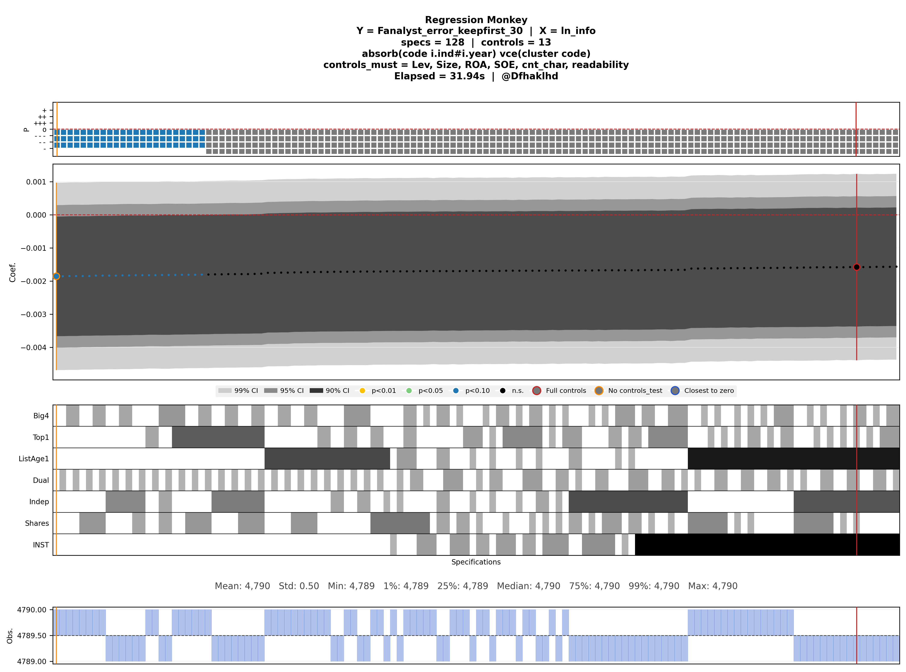

# regression_monkey

作者：`zhao_xun@sjtu.edu.cn`

这是一个独立运行的规格曲线分析工具，用于经济学/会计学实证中的稳健性检验。工具会枚举控制变量的全部合法组合，在吸收多维固定效应后逐一进行 OLS 回归，计算异方差稳健、单向聚类或 CGM 双向聚类标准误，并导出标准结果文件、图片与显著性汇总表。

整体工作流与输出思路借鉴了 Stata 脚本 `spec_curve` 的做法，并在 Python 中扩展为更适合批量配置、自动导出和多规格运行的实现。



## 项目文件

- `regression_monkey.py`：主入口，只负责读取配置、调度分析引擎、调用绘图脚本、导出总汇总
- `regression_monkey_py.py`：Python 分析引擎，只负责枚举规格、回归估计和导出标准结果文件
- `regression_monkey_stata.py`：Stata/reghdfe 分析引擎，只负责运行 Stata 并导出标准结果文件
- `regression_monkey_plot.py`：独立绘图脚本，只从 `*_results.csv` 和 `*_plot_meta.json` 读取结果并生成 PNG
- `regression_monkey_config.toml`：推荐使用的配置文件
- `run_regression_monkey.sh`：示例启动脚本

## 运行环境

项目基于 `uv` 运行，不需要单独维护 `pyproject.toml`。

主要依赖：

- `numpy`
- `pandas`
- `matplotlib`
- `pyreadstat`

## 主要使用方式：配置文件驱动的自动模式

推荐把变量、固定效应标识符和规格开关都写在 `regression_monkey_config.toml` 中，然后直接运行：

```bash
uv run regression_monkey.py
```

如果配置文件不在脚本同目录，也可以显式指定：

```bash
uv run regression_monkey.py regression_monkey_config.toml
```

命令行仍然可以覆盖配置文件中的参数，例如：

```bash
uv run regression_monkey.py regression_monkey_config.toml --dpi 600 --n-jobs 0
```

默认使用 Python 引擎。也可以在 TOML 中设置 `engine = "stata"`，或在命令行指定：

```bash
uv run regression_monkey.py regression_monkey_config.toml --engine stata
```

主入口会先调用对应分析引擎写出临时的 `*_results.csv` 和 `*_plot_meta.json`，再调用 `regression_monkey_plot.py` 生成 PNG。PNG 绘制成功后，主入口默认会删除这两个临时文件；如需保留用于调试或重画，请传 `--keep-temp`。

这种方式最适合日常批量运行，因为：

- 规格组合集中写在 TOML 中，便于复现
- 多个 `y × x` 组合可以一次性批量执行
- 输出目录里会自动保存本次运行的 `config_snapshot.toml`

## 输入数据

支持以下格式：

- `.dta`
- `.csv`
- `.parquet`
- `.pq`

支持多个 `y` 和多个 `x`。程序会自动遍历全部 `y × x` 组合。

## 控制变量的混合结构

`controls_test` 和 `controls_must` 现在都支持在 TOML / Python API 中使用混合结构：

- 普通字符串：表示单个变量
- 嵌套 list：表示一个互斥替代组

两者语义不同：

- `controls_must`

  - 嵌套组表示“必须包含其中之一”
  - 例如 `controls_must = ["Lev", ["ROA", "ROE"]]`
  - 每个规格都必须带 `ROA` 或 `ROE` 其中一个，不能两个都没有，也不能两个同时出现
  - 本质上相当于增加一个必选控制槽位，因此规格数乘以组大小
- `controls_test`

  - 嵌套组表示“最多出现其中一个”
  - 例如 `controls_test = ["Big4", ["ListAge1", "FirmAge1"]]`
  - 每个规格可以选 `ListAge1`、或 `FirmAge1`、或两个都不选，但不能同时选两个
  - 本质上相当于一个可选控制槽位，因此规格数乘以 `组大小 + 1`

示例：

```toml
controls_test = [
  "Big4",
  ["ListAge1", "FirmAge1"],
  "Top1"
]

controls_must = [
  "Lev",
  "Size",
  ["ROA", "ROE"],
  "SOE"
]
```

注意：

- CLI 的 `--controls-test` / `--controls-must` 仍然只能传平铺变量名
- 如果需要混合结构，请使用 `regression_monkey_config.toml` 或 Python API

## 自动模式

自动模式是当前推荐的主要工作流。你通常只需要维护 `regression_monkey_config.toml`，程序会根据其中设为 `true` 的规格开关依次运行。

### 配置文件示例

```toml
data = "path/to/data.dta"
y = ["MPATT"]
x = ["ln_info", "ln_quant", "ln_qual"]
controls_test = ["SOE", "Big4", ["ListAge1", "FirmAge1"]]
controls_must = ["Lev", "Size", ["ROA", "ROE"]]

output = "outputs"
dpi = 300
fig_width = 14
n_jobs = 0

Firm_FE = "code"
Ind_FE = "ind"
Time_FE = "year"
Region_FE = "pref"

absorb_firm_time_vce_cluster_firm = true
absorb_firm_time_vce_robust = false
absorb_firm_indtime_vce_cluster_firm = true
absorb_ind_time_vce_cluster_firm = true
```

### 配置文件相关说明

- TOML 中的规格开关必须使用下划线命名，例如 `absorb_firm_time_vce_cluster_firm`
- CLI 参数使用连字符形式，例如 `--absorb-firm-time-vce-cluster-firm`
- 配置快照只会保留本次运行中实际启用的规格项
- `n_jobs = 0` 表示自动并行，程序会尽量使用更多核，但最多使用 9 核

### 纯命令行启动示例

如果你不想依赖 TOML，也可以直接从 CLI 启用自动规格：

```bash
uv run regression_monkey.py --data panel.dta \
  --y MPATT \
  --x ln_info ln_quant ln_qual \
  --controls-must Lev Size ROA \
  --controls-test SOE Big4 Top1 ln_age Dual Indep Opinion BM Shares \
  --Firm-FE code --Ind-FE ind --Time-FE year --Region-FE pref \
  --absorb-firm-time-vce-cluster-firm \
  --absorb-firm-time-vce-robust \
  --absorb-firm-indtime-vce-cluster-firm \
  --absorb-ind-time-vce-cluster-firm
```

当前支持的预定义规格包括：

- `absorb_firm_time_vce_cluster_firm`
- `absorb_firm_time_vce_robust`
- `absorb_firm_indtime_vce_cluster_firm`
- `absorb_firm_indtime_vce_robust`
- `absorb_firm_regiontime_vce_cluster_firm`
- `absorb_firm_regiontime_vce_robust`
- `absorb_firm_indtime_regiontime_vce_cluster_firm`
- `absorb_firm_indtime_regiontime_vce_robust`
- `absorb_firm_time_vce_cluster_region`
- `absorb_firm_time_vce_cluster_ind`
- `absorb_ind_region_time_vce_cluster_ind`
- `absorb_ind_region_time_vce_robust`
- `absorb_firm_time_vce_cluster_firm_time`
- `absorb_ind_time_vce_cluster_firm`
- `absorb_ind_time_vce_robust`

### 手动模式

如果不启用任何自动规格，也可以直接手动指定固定效应列和聚类列。

示例：

```bash
uv run regression_monkey.py --data panel.dta \
  --y MPATT \
  --x ln_info \
  --controls-must Lev Size ROA \
  --controls-test SOE Big4 Top1 ln_age Dual Indep Opinion BM Shares \
  --fe ind year \
  --clust code
```

自动生成第二聚类变量：

```bash
uv run regression_monkey.py --data panel.dta \
  --y MPATT \
  --x ln_info \
  --controls-must Lev Size ROA \
  --controls-test SOE Big4 Top1 ln_age Dual Indep Opinion BM Shares \
  --fe ind year \
  --clust code \
  --gen-clust2
```

## 输出结果

每次运行都会在 `output` 指定目录下自动创建时间戳子目录，例如：

```text
outputs/20260414_174122/
```

目录中通常包括：

- `config_snapshot.toml`：本次运行的有效配置快照
- 多张 PNG 图片：每个 `y × x × 规格` 对应一张图
- `sig.csv`：全运行合并后的显著性汇总表

如果运行时传入 `--keep-temp`，目录中还会保留：

- `*_results.csv`：每个 `y × x × 规格` 的标准回归结果文件
- `*_plot_meta.json`：对应结果文件的绘图元数据
- Stata 引擎的 `.do`、`.log`、`*_stata_results.dta` 和临时输入 `.dta`

标准结果文件字段固定为：

```text
coef,se,t_value,p_value,df_resid,ci99_lo,ci99_hi,ci95_lo,ci95_hi,ci90_lo,ci90_hi,controls_test,controls_all,is_full,obs
```

其中 `controls_test` 和 `controls_all` 使用 JSON 数组字符串保存，避免控制变量名中出现逗号或特殊字符时产生歧义。

### 图片命名

默认图片名格式为：

```text
<y>_<x>_<规格标签>.png
```

其中自动规格的固定效应标签统一带有 `_ab_` 前缀，例如：

- `MPATT_ln_info_ab_firm_time_cl_firm.png`
- `MPATT_ln_info_ab_firm_time_robust.png`
- `MPATT_ln_info_ab_ind_time_cl_firm.png`

### 图片内容

当前图片是一个多面板输出，包含：

- 标题面板：显示 `Regression Monkey`、`Y/X`、`specs/controls`、`absorb/vce`、`controls_must`、单图全过程耗时
- 系数面板：主解释变量点估计，以及 90% / 95% / 99% 置信区间带
- 控制变量矩阵：显示每个会随规格变化的控制变量是否被纳入
- 描述性统计面板：显示 `obs` 的均值、分位数等
- `Obs` 面板：按系数正负着色的条形图

图形约定如下：

- 置信区间保持灰阶：
  - 99% CI：浅灰
  - 95% CI：灰
  - 90% CI：深灰
- 系数点按显著性着色：
  - `p < 0.01`：黄色
  - `p < 0.05`：绿色
  - `p < 0.10`：蓝色
  - 不显著：黑色
- 三类特殊规格使用同一套“实心点 + 彩色外圈 + 同色竖线”样式：
  - 全控制变量规格：红色
  - 无 `controls_test` 规格：橙色
  - 系数最接近 0 的规格：蓝色，仅当系数序列跨过 `0` 时才绘制
- 红色 `Full controls` 特殊点后绘制，覆盖在普通点、橙色点和蓝色点之上
- 控制变量矩阵中会显示所有会变化的控制变量：
  - 全部 `controls_test`
  - `controls_must` 中以嵌套 list 给出的替代组成员
- 控制变量矩阵带有黑色整体外框、黑色行分隔线，并同步标出红 / 橙 / 蓝三类竖线
- `Obs` 面板当前为条形图：
  - 正系数规格：半透明红色条
  - 负系数规格：半透明蓝色条
  - 灰色虚线表示 `obs` 均值
  - 左侧刻度显示 `min / mean / max`，保留两位小数
  - 同步标出红 / 橙 / 蓝三类竖线

### 显著性汇总表

程序会把本次全部运行结果中的显著规格合并导出为：

```text
<output_dir>/<timestamp>/sig.csv
```

字段包括：

- `Star`
- `coef`
- `obs`
- `Y`
- `X`
- `Controls`
- `FE`
- `cluster`
- `Specs`

其中：

- `Star = 3 / 2 / 1` 表示正系数分别在 99% / 95% / 90% 水平显著
- `Star = -3 / -2 / -1` 表示负系数分别在 99% / 95% / 90% 水平显著
- 当标准误类型为 `vce(robust)` 时，`cluster` 列会显示为 `robust`
- `Controls` 列严格按输入顺序导出：先 `controls_must`，后 `controls_test`
- `Specs` 表示当前这一轮对应的规格总数

终端中的汇总输出会在全部回归结束后，按 `Y × X` 组合统一报告，例如：

```text
Y = FAATT  ×  X = ln_info 51/768 个规格显著（+3:0  +2:0  +1:0  -1:51  -2:0  -3:0）
Y = FAATT  ×  X = ln_qual 无 90% 及以上显著的规格
```

## 性能说明

程序的主要耗时来自对控制变量组合的穷举。若全部都是普通 `controls_test` 变量且个数为 12，则单个规格需要估计 `4096` 个回归；混合结构时，总规格数取决于各控制槽位的乘积。

更准确地说：

- 普通 `controls_test` 变量：每个贡献 `×2`
- `controls_test` 替代组，大小为 `g`：贡献 `×(g+1)`
- 普通 `controls_must` 变量：贡献 `×1`
- `controls_must` 替代组，大小为 `g`：贡献 `×g`

当前代码已经包含以下性能优化：

- 固定效应残差化后再枚举规格
- 小任务自动避免无收益并行
- 优先使用更低启动成本的 multiprocessing 上下文
- 自动并行时使用扁平化 chunk 调度，避免嵌套 `multiprocessing.Pool`
- 延迟导入 Matplotlib，避免 worker 启动时重复加载绘图库

## Stata 批处理模式

仓库还提供 `regression_monkey_stata.py`，用于调用 Stata CLI 的 batch 模式并使用 `reghdfe` 作为估计引擎。推荐仍然通过主入口调度：

```bash
uv run regression_monkey.py regression_monkey_config.toml --engine stata
```

分析脚本会为每个 `y × x × 规格` 输出标准结果文件：

- `*_results.csv`：回归结果、置信区间、控制变量组合和样本量
- `*_plot_meta.json`：绘图需要的变量名、控制变量顺序、标题和输出路径

绘图脚本可以单独重画已有结果，不需要重新读取原始数据或重新回归：

```bash
uv run regression_monkey_plot.py --results path/to/foo_results.csv --meta path/to/foo_plot_meta.json --output path/to/foo.png
```

通过主入口运行时，这两个标准结果文件默认会在 PNG 绘制成功后删除。需要单独重画时，请在主入口运行时加上 `--keep-temp`。

这一模式下：

- Stata 引擎负责生成 `.do` 文件、调用 Stata、读取结果并导出标准结果文件
- 主入口负责调用独立绘图脚本；绘图脚本不读取原始数据，也不依赖 Stata
- `absorb()` 和 `vce()` 直接写成 `reghdfe` 形式，例如 `absorb(i.code i.year#i.ind)`
- 每个规格的 `obs` 由 `reghdfe` 基于该规格的有效样本自动决定，不会因为 `controls_test` 被统一提前删样本
- `controls_must` / `controls_test` 的混合结构语义与 Python 引擎保持一致
- 若未指定 `--keep-temp`，运行结束后会自动删除中间 `.do`、`.log` 和临时结果文件

## 开发与验证

推荐的基础检查：

```bash
uv run python -m py_compile regression_monkey.py regression_monkey_py.py regression_monkey_stata.py regression_monkey_plot.py
```

用现有 TOML 跑 Python 引擎端到端：

```bash
uv run regression_monkey.py regression_monkey_config.toml --engine python --n-jobs 1
```

只重画已有结果：

```bash
uv run regression_monkey_plot.py \
  --results outputs/<timestamp>/<name>_results.csv \
  --meta outputs/<timestamp>/<name>_plot_meta.json \
  --output outputs/<timestamp>/<name>_replot.png
```

实现约定：

- `regression_monkey.py` 保持轻量，只做配置、调度、汇总和调用绘图
- `regression_monkey_py.py` 和 `regression_monkey_stata.py` 不直接生成 PNG，只写标准结果文件和绘图元数据
- `regression_monkey_plot.py` 只读取 `*_results.csv` 和 `*_plot_meta.json`
- 主入口绘图成功后默认删除每张图对应的 `*_results.csv` 和 `*_plot_meta.json`；`--keep-temp` 用于保留这些中间文件
- 新增分析字段时，需要同步更新标准结果文件的读写逻辑和绘图元数据
- 输出目录、文件名和 `sig.csv` 结构应尽量保持向后兼容

如果希望更稳定地观察运行状态，可以注意终端中的进度输出。枚举规格时程序会打印总任务块数，并周期性输出进度百分比。

## 结果解释与注意事项

- 自动模式下，程序会在需要时自动生成交互固定效应列，例如 `ind#year` 或 `region#year`
- 每个规格会基于 `y`、`x`、`controls_test`、`controls_must`、固定效应列和聚类列对应的数据进行缺失值处理
- 所有规格在绘图前会按主解释变量系数从小到大排序
- 开启更多规格，尤其是 `vce_robust` 或 CGM 双向聚类规格时，总耗时会明显上升
