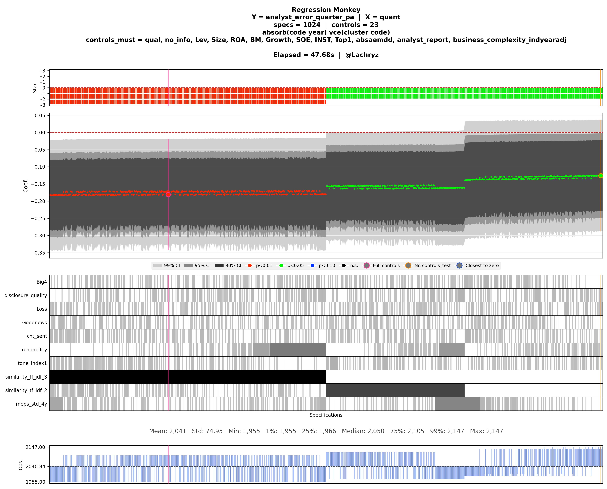
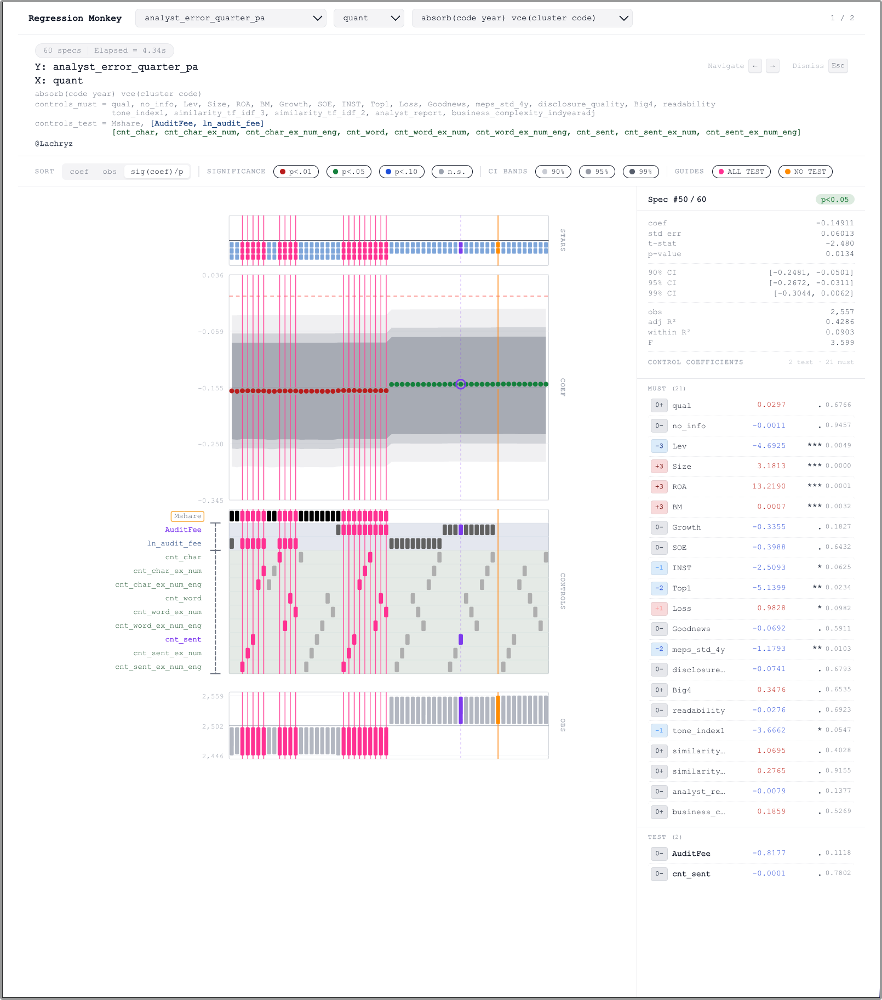

# regression_monkey

Author: `zhao_xun@sjtu.edu.cn` · License: [MIT](LICENSE)

A standalone specification curve analysis tool for econometric robustness checks. It enumerates all valid combinations of control variables, estimates OLS with N-way absorbed fixed effects, computes heteroskedasticity-robust, one-way clustered, or CGM two-way clustered standard errors, and exports publication-ready figures and a significance summary table.

The workflow and output design draw on Stata's `spec_curve` command and extend it with batch configuration, parallel execution, and two export formats.

## Output modes

**PNG mode** — static publication-quality figure exported as a raster image.



**HTML mode** — a self-contained interactive webpage. Hover to highlight a specification across all panels; click to pin it. Sort specifications by coefficient, observation count, or signed significance. Switch Y, X, and fixed-effect spec from a top selector bar when multiple combinations are present.



## Requirements

Dependencies are declared in `pyproject.toml` and managed by `uv`.

```bash
uv sync
```

Core dependencies: `numpy`, `pandas`, `matplotlib`, `pyreadstat`.

## Quick start

The recommended workflow is config-file driven. Copy `config/regression_monkey_example.toml`, fill in your variable names and file path, then run:

```bash
uv run regression-monkey
```

Or point to the config explicitly:

```bash
uv run regression-monkey config/regression_monkey_config.toml
```

CLI flags override any TOML value:

```bash
uv run regression-monkey config/regression_monkey_config.toml --dpi 600 --n-jobs 0
```

Export format is controlled by `--export-format`:

```bash
# PNG only (default)
uv run regression-monkey config/regression_monkey_config.toml --export-format png

# Interactive HTML only
uv run regression-monkey config/regression_monkey_config.toml --export-format html

# Both
uv run regression-monkey config/regression_monkey_config.toml --export-format both
```

## Configuration file

```toml
data = "path/to/data.dta"
y = ["MPATT"]
x = ["ln_info", "ln_quant", "ln_qual"]
controls_test = ["SOE", "Big4", ["ListAge1", "FirmAge1"]]
controls_must = ["Lev", "Size", ["ROA", "ROE"]]

output = "outputs"
export_format = "png"   # png | html | both
dpi = 300
fig_width = 14
n_jobs = 0              # 0 = auto-parallel (up to 9 cores)

Firm_FE   = "code"
Ind_FE    = "ind"
Time_FE   = "year"
Region_FE = "pref"

absorb_firm_time_vce_cluster_firm    = true
absorb_firm_indtime_vce_cluster_firm = true
absorb_ind_time_vce_cluster_firm     = true
```

A complete template is at `config/regression_monkey_example.toml`.

## Input data

Supported formats: `.dta`, `.csv`, `.parquet`, `.pq`.

Multiple `y` and `x` values are accepted; all y × x combinations are processed in one run.

## Control variable structure

Both `controls_test` and `controls_must` support a mixed structure in TOML or the Python API:

| Syntax | Meaning |
| ------ | ------- |
| `"var"` | single variable |
| `"var1 var2"` | two flat variables, same as listing them separately |
| `["A", "B"]` | mutually exclusive alternative group |

Semantics differ:

- **`controls_test`** — each plain entry is optional (include or not). An alternative group means *at most one* of its members is included. Adds a factor of `(group_size + 1)` to the total spec count.
- **`controls_must`** — each plain entry is always included. An alternative group means *exactly one* of its members is included. Adds a factor of `group_size`.

A variable that appears in both lists causes an immediate error.

## Predefined fixed-effect specs

The auto mode selects from a catalog of 15 predefined FE + cluster combinations. Terminal output and spec headers show the Stata-style `absorb(...) vce(...)` form; internal keys use underscores.

| TOML key | Stata equivalent |
| -------- | ---------------- |
| `absorb_firm_time_vce_cluster_firm` | `absorb(firm year) vce(cluster firm)` |
| `absorb_firm_indtime_vce_cluster_firm` | `absorb(firm i.ind#i.year) vce(cluster firm)` |
| `absorb_firm_regiontime_vce_cluster_firm` | `absorb(firm i.region#i.year) vce(cluster firm)` |
| `absorb_firm_indtime_regiontime_vce_cluster_firm` | `absorb(firm i.ind#i.year i.region#i.year) vce(cluster firm)` |
| `absorb_firm_time_vce_cluster_region` | `absorb(firm year) vce(cluster region)` |
| `absorb_firm_time_vce_cluster_ind` | `absorb(firm year) vce(cluster ind)` |
| `absorb_firm_time_vce_cluster_firm_time` | `absorb(firm year) vce(cluster firm year)` |
| `absorb_ind_region_time_vce_cluster_ind` | `absorb(ind region year) vce(cluster ind)` |
| `absorb_ind_time_vce_cluster_firm` | `absorb(ind year) vce(cluster firm)` |
| `absorb_firm_time_vce_robust` | `absorb(firm year) vce(robust)` |
| *(and robust variants of the above)* | |

Manual FE mode bypasses the catalog:

```bash
uv run regression-monkey --data panel.dta \
    --y MPATT --x ln_info \
    --controls-must Lev Size ROA \
    --controls-test SOE Big4 Top1 \
    --fe ind year --clust code
```

Add `--gen-clust2` to auto-generate a `fe[0]_fe[1]` second cluster column.

## Output structure

Each run creates a timestamped subdirectory:

```
outputs/20260414_174122/
  config_snapshot.toml
  sig.csv
  ab_firm_time_cl_firm/
    MPATT_ln_info_ab_firm_time_cl_firm.png
  ab_firm_indtime_cl_firm/
    MPATT_ln_info_ab_firm_indtime_cl_firm.png
  interactive.html          # only in html / both mode
```

`sig.csv` lists all significant specifications across the entire run, sorted by `p_value` ascending. Fields: `Star`, `coef`, `p_value`, `t_value`, `obs`, `Y`, `X`, `Controls`, `FE`, `cluster`, `Specs`, and grouping columns when applicable.

Star values: `+3/+2/+1` for positive coefficients significant at 99%/95%/90%; `-3/-2/-1` for negative.

## Stata engine

Switch to `reghdfe` by setting `engine = "stata"` in TOML or passing `--engine stata`:

```bash
uv run regression-monkey config/regression_monkey_config.toml --engine stata
```

The Stata engine also supports subgroup heterogeneity analysis via `grouping_variable_by_ind_time`, `grouping_variable_by_time`, or `grouping_variable_by_none`. For each grouping variable, one extended figure is produced showing the main coefficient curve, `b_z=0/1` subgroup curves, and the `c.x#c.z` interaction coefficient — all in the same PNG. The legacy key `grouping_variable` remains as an alias for `grouping_variable_by_ind_time`.

## Redrawing from saved results

Plot from an existing results file without re-running regressions:

```bash
# PNG
uv run regression-monkey-plot \
    --results outputs/<timestamp>/foo_results.csv \
    --meta    outputs/<timestamp>/foo_plot_meta.json \
    --output  outputs/<timestamp>/foo_replot.png

# HTML
uv run regression-monkey-html \
    --results outputs/<timestamp>/foo_results.csv \
    --meta    outputs/<timestamp>/foo_plot_meta.json \
    --output  outputs/<timestamp>/foo_interactive.html
```

Pass `--keep-temp` to the main entry point to retain `*_results.csv` and `*_plot_meta.json` after a run.

## Performance

Total spec count = product of per-slot factors:

| Slot type | Factor |
| --------- | ------ |
| Plain `controls_test` variable | ×2 |
| `controls_test` alternative group of size *g* | ×(*g*+1) |
| Plain `controls_must` variable | ×1 |
| `controls_must` alternative group of size *g* | ×*g* |

12 plain `controls_test` variables → 4 096 regressions per spec.

The Python engine demeans Y, X, and all controls by the fixed effects once before enumeration (Frisch-Waugh-Lovell), then runs OLS on the residuals for each combination. Parallelism uses a flat chunk schedule to avoid nested `multiprocessing.Pool` overhead; Matplotlib is imported lazily in workers.
