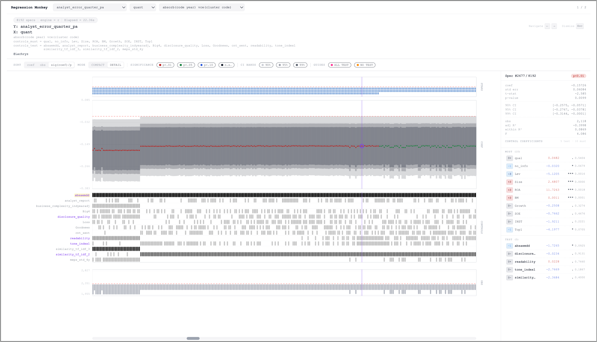
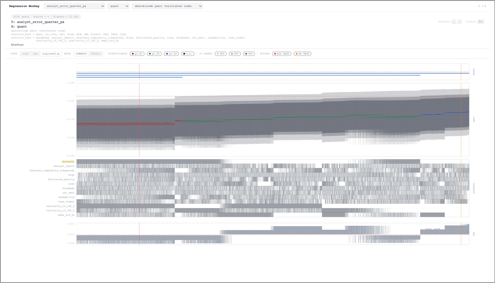

# 回归猴子

作者：`zhao_xun@sjtu.edu.cn`

许可证：MIT License，见 [LICENSE](LICENSE)。

> 献给我最爱的于昊平

[固定效应与标准误选取指南](./assets/固定效应与聚类标准误选取指南.md)

这是一个独立运行的规格曲线分析工具，用于经济学/会计学实证中的稳健性检验。工具会枚举控制变量的全部合法组合，在吸收多维固定效应后逐一进行 OLS 回归，计算异方差稳健、单向聚类或 CGM 双向聚类标准误，并导出标准结果文件、图片与显著性汇总表。

整体工作流与输出思路借鉴了 Stata 脚本 `spec_curve` 的做法，并在 Python 中扩展为更适合批量配置、自动导出和多规格运行的实现。

**PNG 模式** — 静态导出，适合直接插入论文或报告。

**HTML 模式** — 自包含交互网页，包含 `DETAIL` 和 `COMPACT` 两种视图。规格数超过 1024 时默认打开 `COMPACT`；较小图表禁用 `COMPACT` 并直接进入 `DETAIL`。多个 Y × X × 固定效应规格可通过顶部选择栏在同一文件内切换，并支持按系数、样本量或带符号显著性排序。

`DETAIL` 是完整交互视图：悬停可在所有面板同步高亮同一规格，点击可固定当前规格，右侧详情栏按用户输入顺序列出纳入的控制变量和对应统计量。COEF 置信区间按单个规格切片绘制，保留更接近 PNG 的细碎边缘质感；不显著 STAR 单元格使用带符号方向的空心标记。



`COMPACT` 是面向大规模规格集的密集总览视图：隐藏右侧详情栏，关闭中央图表的悬停/点击选择，在达到 8192 个规格的基准列宽后不再继续压缩，并在图表宽于视口时允许横向滚动。紧凑图首次渲染后会缓存为一张位图，后续滚动只重绘可见切片；排序、筛选、Guide/CI 开关和窗口尺寸变化时才重建缓存。STARS、CONTROL 和 OBS 使用接近 PNG 的连续线条或细方块，COMPACT 中的 COEF 点会按基准列宽缩放。



## 项目文件

- `src/regression_monkey/__main__.py`：主入口，只负责读取配置、调度分析引擎、调用绘图脚本、导出总汇总
- `src/regression_monkey/engine/py.py`：Python 分析引擎，只负责枚举规格、回归估计和导出标准结果文件
- `src/regression_monkey/engine/stata.py`：Stata/reghdfe 分析引擎，只负责运行 Stata 并导出标准结果文件
- `src/regression_monkey/engine/r.py`：R/fixest 分析引擎，只负责调用 `Rscript` 并导出标准结果文件
- `src/regression_monkey/plot/png.py`：独立绘图脚本，只从 `*_results.csv` 和 `*_plot_meta.json` 读取结果并生成 PNG
- `src/regression_monkey/plot/html.py`：独立交互式网页脚本，只从同一批标准结果文件读取结果并生成自包含 HTML
- `config/config.example.toml`：推荐使用的配置文件

## 运行环境

项目基于 `uv` 运行，依赖在 `pyproject.toml` 中声明。运行前需执行 `uv sync` 安装依赖。

主要依赖：

- `numpy`
- `pandas`
- `matplotlib`
- `pyreadstat`

## 主要使用方式：配置文件驱动的自动模式

推荐把变量、固定效应标识符和规格开关都写在 `config/config.example.toml` 中，然后直接运行：

```bash
uv run regression-monkey
```

如果配置文件不在默认位置，也可以显式指定：

```bash
uv run regression-monkey config/config.example.toml
```

命令行仍然可以覆盖配置文件中的参数，例如：

```bash
uv run regression-monkey config/config.example.toml --dpi 600 --n-jobs 0
```

默认使用 Python 引擎。也可以在 TOML 中设置 `engine = "stata"` / `engine = "r"`，或在命令行指定：

```bash
uv run regression-monkey config/config.example.toml --engine stata
uv run regression-monkey config/config.example.toml --engine r
```

主入口会先调用对应分析引擎写出临时的 `*_results.csv` 和 `*_plot_meta.json`，再调用独立导出脚本生成结果。默认生成 PNG；如果希望用交互式网页替代图片，可传 `--export-format html`，或传 `--export-format both` 同时导出 PNG 和 HTML。导出成功后，主入口默认会删除这两个临时文件；如需保留用于调试或重画，请传 `--keep-temp`。

PNG 和 HTML 的标题元数据都会显示本图使用的分析引擎：`python`、`stata` 或 `r`。HTML 中该信息位于规格数量旁；PNG 中位于顶部标题信息行。

外部引擎的耗时统计会把本次运行的 handoff/setup 时间、模型估计时间和导出渲染时间纳入进度估计；Stata 模式下首张图会计入临时 `.dta` 准备时间。

交互式 HTML 在切换排序时会复用导出时保存的系数轴比例，因此置信区间的视觉长度与结果文件中的 `ci90/ci95/ci99` 数值保持一致。

若使用 Stata 引擎，还可以在 TOML / CLI 中设置 `grouping_variable_by_ind_time`、`grouping_variable_by_time`、`grouping_variable_by_none`。这些列可以是连续数值变量；程序会为每个分组变量生成一张扩展图，同图展示主回归系数、按动态中位数二分后的两组分组回归系数，以及把 `c.x#c.z` 加入 RHS 后的交乘项系数。Python / R 引擎暂不支持这些参数。旧参数 `grouping_variable` 仍可用，等价于 `grouping_variable_by_ind_time`。

这种方式最适合日常批量运行，因为：

- 规格组合集中写在 TOML 中，便于复现
- 多个 `y × x` 组合可以一次性批量执行
- 输出目录里会自动保存本次运行的 `config_snapshot.toml`

## 输入数据

支持以下格式：

- `.dta`
- `.csv`
- `.parquet`
- `.pq`

支持多个 `y` 和多个 `x`。程序会自动遍历全部 `y × x` 组合。

## 控制变量的混合结构

`controls_test` 和 `controls_must` 现在都支持在 TOML / Python API 中使用混合结构：

- 普通字符串：表示单个变量
- 空格分隔字符串：表示多个连续普通变量，例如 `"var1 var2 var3"` 等价于 `"var1", "var2", "var3"`
- 嵌套 list：表示一个互斥替代组
- 嵌套 list 内也可以使用空格分隔字符串，例如 `["ROA ROE", "ROIC"]` 等价于 `["ROA", "ROE", "ROIC"]`

两者语义不同：

- `controls_must`
  - 嵌套组表示“必须包含其中之一”
  - 例如 `controls_must = ["Lev", ["ROA", "ROE"]]`
  - 每个规格都必须带 `ROA` 或 `ROE` 其中一个，不能两个都没有，也不能两个同时出现
  - 本质上相当于增加一个必选控制槽位，因此规格数乘以组大小
- `controls_test`
  - 嵌套组表示“最多出现其中一个”
  - 例如 `controls_test = ["Big4", ["ListAge1", "FirmAge1"]]`
  - 每个规格可以选 `ListAge1`、或 `FirmAge1`、或两个都不选，但不能同时选两个
  - 本质上相当于一个可选控制槽位，因此规格数乘以 `组大小 + 1`
  - 若同一变量同时出现在 `controls_must` 和 `controls_test`，程序会直接报错，提示这些变量不可同时放在两个 list 中

示例：

```toml
controls_test = [
  "Big4 Top1",
  ["ListAge1", "FirmAge1"],
]

controls_must = [
  "Lev Size",
  ["ROA ROE"],
  "SOE"
]
```

注意：

- CLI 的 `--controls-test` / `--controls-must` 仍然只能表达平铺变量名；shell 已经会按空格拆成多个参数
- 如果需要混合结构，请使用 `config/config.example.toml` 或 Python API

## 自动模式

自动模式是当前推荐的主要工作流。你通常只需要维护 `config/config.example.toml`，程序会根据其中设为 `true` 的规格开关依次运行。

### 配置文件示例

仓库中提供了一个完整模板：`config/config.example.toml`。复制后把 `data`、`y`、`x`、控制变量和固定效应列名改成你的真实字段即可。

```toml
data = "path/to/data.dta"
y = ["MPATT"]
x = ["ln_info", "ln_quant", "ln_qual"]
controls_test = ["SOE", "Big4", ["ListAge1", "FirmAge1"]]
controls_must = ["Lev", "Size", ["ROA", "ROE"]]

output = "outputs"
export_format = "png"  # png：静态图片；html：交互式网页；both：两者都导出
dpi = 300
fig_width = 14
n_jobs = 0

Firm_FE = "code"
Ind_FE = "ind"
Time_FE = "year"
Region_FE = "pref"

absorb_firm_time_vce_cluster_firm = true
absorb_firm_time_vce_robust = false
absorb_firm_indtime_vce_cluster_firm = true
absorb_ind_time_vce_cluster_firm = true
```

### 配置文件相关说明

- TOML 中的规格开关必须使用下划线命名，例如 `absorb_firm_time_vce_cluster_firm`
- CLI 参数使用连字符形式，例如 `--absorb-firm-time-vce-cluster-firm`
- 配置快照只会保留本次运行中实际启用的规格项
- `n_jobs = 0` 表示自动并行，程序会尽量使用更多核，但最多使用 9 核

### 纯命令行启动示例

如果你不想依赖 TOML，也可以直接从 CLI 启用自动规格：

```bash
uv run regression-monkey --data panel.dta \
  --y MPATT \
  --x ln_info ln_quant ln_qual \
  --controls-must Lev Size ROA \
  --controls-test SOE Big4 Top1 ln_age Dual Indep Opinion BM Shares \
  --Firm-FE code --Ind-FE ind --Time-FE year --Region-FE pref \
  --absorb-firm-time-vce-cluster-firm \
  --absorb-firm-time-vce-robust \
  --absorb-firm-indtime-vce-cluster-firm \
  --absorb-ind-time-vce-cluster-firm
```

当前支持的预定义规格包括：

- `absorb_firm_time_vce_cluster_firm`
- `absorb_firm_time_vce_robust`
- `absorb_firm_indtime_vce_cluster_firm`
- `absorb_firm_indtime_vce_robust`
- `absorb_firm_regiontime_vce_cluster_firm`
- `absorb_firm_regiontime_vce_robust`
- `absorb_firm_indtime_regiontime_vce_cluster_firm`
- `absorb_firm_indtime_regiontime_vce_robust`
- `absorb_firm_time_vce_cluster_region`
- `absorb_firm_time_vce_cluster_ind`
- `absorb_ind_region_time_vce_cluster_ind`
- `absorb_ind_region_time_vce_robust`
- `absorb_firm_time_vce_cluster_firm_time`
- `absorb_ind_time_vce_cluster_firm`
- `absorb_ind_time_vce_robust`

终端进度和规格标题会把这些内部名称显示为更易读的 `reghdfe` 风格写法，并追加明确的标准误标签，例如 `absorb_firm_indtime_vce_cluster_firm` 会显示为 `absorb(firm i.ind#i.time) vce(cluster firm) Std.Err.=cluster(firm)`，稳健标准误会显示 `Std.Err.=Robust`；内部参数名、输出文件名和配置键不变。

### 手动模式

如果不启用任何自动规格，也可以直接手动指定固定效应列和聚类列。

示例：

```bash
uv run regression-monkey --data panel.dta \
  --y MPATT \
  --x ln_info \
  --controls-must Lev Size ROA \
  --controls-test SOE Big4 Top1 ln_age Dual Indep Opinion BM Shares \
  --fe ind year \
  --clust code
```

自动生成第二聚类变量：

```bash
uv run regression-monkey --data panel.dta \
  --y MPATT \
  --x ln_info \
  --controls-must Lev Size ROA \
  --controls-test SOE Big4 Top1 ln_age Dual Indep Opinion BM Shares \
  --fe ind year \
  --clust code \
  --gen-clust2
```

## 输出结果

每次运行都会在 `output` 指定目录下自动创建时间戳子目录，例如：

```text
outputs/20260414_174122/
```

目录中通常包括：

- `config_snapshot.toml`：本次运行的有效配置快照
- 按固定效应和聚类组合分组的 PNG 导出子文件夹；HTML 模式只在运行根目录写一个 `interactive.html`
- `sig.csv`：全运行合并后的显著性汇总表

主入口会按启用规格逐个估计并立即导出对应结果，不会等同一个 `y × x` 的全部规格都跑完后再集中出图；Stata 引擎也会在每个 reghdfe 规格返回结果后立刻导出。
PNG 会保存到时间戳目录下按固定效应和聚类组合命名的子文件夹；HTML 模式只在时间戳根目录生成一个 `interactive.html`，不会创建空的规格子文件夹。`config_snapshot.toml`、`sig.csv`、`*_results.csv`、`*_plot_meta.json`、Stata `.do`、`.log`、`*_stata_results.dta` 和临时输入 `.dta` 都保留在时间戳根目录，不进入导出子文件夹。
每张图开始回归前，终端会打印 `[本图回归数] 256 个回归` 这类纯数量提示；普通图等于该图的控制变量组合数，Stata 分组扩展图按每个控制变量组合的动态 all 样本回归、`b_var=0/1` 两组回归、以及交乘项回归合计。
主入口会根据本次运行的总导出数显示进度条，每个逻辑图导出完成后更新一次进度。
进度条会按固定效应类型（例如 `firm+time`、`firm+_ind_time`）记录实际耗时；等本次运行涉及的每类固定效应都至少完成一张图后，开始显示预计剩余时间和预计完成时刻，并随后续结果动态更新。进度行不附加 PNG 文件名。

如果运行时传入 `--keep-temp`，目录中还会保留：

- `*_results.csv`：每个 `y × x × 规格` 的标准回归结果文件
- `*_plot_meta.json`：对应结果文件的绘图元数据
- Stata 引擎的 `.do`、`.log`、`*_stata_results.dta` 和临时输入 `.dta`

标准结果文件字段固定为：

```text
coef,se,t_value,p_value,df_resid,ci99_lo,ci99_hi,ci95_lo,ci95_hi,ci90_lo,ci90_hi,controls_test,controls_all,is_full,obs
```

其中 `controls_test` 和 `controls_all` 使用 JSON 数组字符串保存，避免控制变量名中出现逗号或特殊字符时产生歧义。

### 图片命名

默认图片名格式为：

```text
<固定效应和聚类组合>/<y>_<x>_<规格标签>.png
```

其中自动规格的固定效应标签统一带有 `_ab_` 前缀，例如：

- `ab_firm_time_cl_firm/MPATT_ln_info_ab_firm_time_cl_firm.png`
- `ab_firm_time_robust/MPATT_ln_info_ab_firm_time_robust.png`
- `ab_ind_time_cl_firm/MPATT_ln_info_ab_ind_time_cl_firm.png`

### 交互式网页

传入 `--export-format html` 时，主入口不生成 PNG，而是在运行目录生成一个 `interactive.html`；传入 `--export-format both` 时，保留每张 PNG，同时额外生成这一个总 HTML。HTML 是自包含文件，不需要额外服务器。

总 HTML 在现有图表选项栏上方增加一行全局选项栏，可按因变量、自变量和固定效应/聚类规格切换不同结果，因此多个 y×x×spec 结果只需打开一个 HTML；最上方只显示三个选择框，不显示 `Y`、`X`、`SPEC` 字符标签。单个图表内部会复用 PNG 的排序和控制变量矩阵，并且规格标题只显示 `absorb(...) vce(...)` 这类 Stata 风格语句，不追加重复解释文字，下面两行显示 `controls_must = ...` 和 `controls_test = ...`，这两行使用更宽的换行阈值；`controls_test` 中多个“选 0 或 1 个”的替代组会用 `[]` 包裹。HTML 不再区分命令行或元数据里的 `p` / `coef` 绘图模式；网页顶栏提供 `coef`、`obs`、`sig(coef)/p` 三种交互排序，默认选中并应用 `sig(coef)/p`，选中按钮的白色块会常态显示且不会被图内点选中状态清除。鼠标悬停到任一规格点或该列区域时，会同时高亮 STARS、系数、控制矩阵、Obs 面板中对应的竖向位置；点击规格点会固定当前选择，再次点击同一点或按 `Esc` 取消固定，点击别的点会切换固定选择。STARS 面板不再为非显著规格绘制零线段；普通显著星格按方向着色，正系数为红灰色、负系数为蓝灰色，选中时变为紫色。COEF 面板中的 0 线使用更粗的红色虚线。本次回归包含的控制变量黑色单元和 Obs 色块会变为紫色高亮，对应控制变量名称也会同步变色；右侧详情栏显示该规格的系数、p 值、t 值、置信区间、样本量、adjusted R²、within R² 和 F 值，并按用户输入顺序把控制变量拆成 `MUST` 与 `TEST` 两组展示，其中 `MUST` 在前、`TEST` 在后。右侧详情栏标题行的 `COPY` 按钮会复制当前规格实际纳入的控制变量名，变量名之间用空格分隔，顺序与详情栏一致。右侧每个控制变量名前都有一个方块徽标，按该控制变量自身的系数和 p 值显示 `-3` 到 `+3`；不显著时按符号显示 `0-` 或 `0+` 并使用灰色底，显著负向为浅蓝底深蓝字，显著正向为浅红底深红字。右侧详情栏始终按原始输入顺序显示所有 `controls_test` 变量；当前规格未纳入回归的 TEST 变量只保留变量名和一个空白徽标框，系数和 p 值等列留空。Stata 引擎生成的 HTML 会在右侧详情栏保留每个已纳入控制变量的真实系数和 p 值；没有控制变量统计的旧结果文件会继续显示占位。点击右侧详情栏中的控制变量行会切换该变量的显著性过滤；多选时使用 AND 逻辑，主绘图区会移除不匹配规格，并把剩余规格重新连续排列；保留下来的规格必须满足所有已选控制变量自身 p 值均小于 0.10，当前过滤条件会显示在右侧并可清空。HTML 也会显示与 PNG 一致的 `Full controls` 红色辅助竖线和 `No controls_test` 橙色辅助竖线；顶栏 `Guides` 里的 `ALL TEST`、`NO TEST` 和 `BEST TEST` 可分别开关红色、橙色和黄色辅助线；当 3 星显著规格中没有 full-test 规格时，`BEST TEST` 会标记 3 星显著规格中纳入 `controls_test` 数量最多的那一个，并按更小 `p_value` 和原始顺序打破并列。未选中时，`Full controls` 对应的控制变量色块同样使用红色，选中时对应列也会和普通规格一样变为紫色高亮。`controls_must` 替代组在控制变量矩阵左侧用实线工字线标记，`controls_test` 替代组用虚线工字线标记；HTML 中 `controls_test` 的多变量替代子组会自动使用一致的深色，并同步用于标题行的 `[...]`、CONTROLS 左侧变量名和对应矩阵色块，例如第一组为深蓝色。STARS、COEF、CONTROLS、OBS 四个主面板会根据右侧详情栏后的可用宽度动态收缩，并在超过当前可用宽度时只让面板内容内部同步横向滚动，确保右侧的 STARS、COEF、CONTROLS、OBS 标签不会被详情栏挡住；左侧刻度、控制变量名、工字线位于白色固定边栏上方，不会被中间滚动内容覆盖；如果所有 3 星显著规格都包含某个 `controls_test`，该控制变量名会加黄色底纹。

HTML 会把 Courier New 字体以内嵌 `@font-face` 的形式写入文件，因此复制单个 HTML 到其他位置查看时仍会使用同一字体。

### 图片内容

当前图片是一个多面板输出，包含：

- 标题面板：显示 `Regression Monkey`、`Y/X`、`specs/controls`、`absorb/vce`、`controls_must`、单图全过程耗时
- `Star` 面板：按显著性星级和系数方向显示每个规格的显著性
- 系数面板：主解释变量点估计，以及 90% / 95% / 99% 置信区间带
- 控制变量矩阵：显示每个会随规格变化的控制变量是否被纳入
- 描述性统计面板：显示 `obs` 的均值、分位数等
- `Obs` 面板：显示相对均值的条形图，左轴仍为实际样本量
- HTML 中 `Star` / `Coef.` / `Obs.` 等右侧面板标签顺时针旋转 90 度

图形约定如下：

- 置信区间保持灰阶：
  - 99% CI：浅灰
  - 95% CI：灰
  - 90% CI：深灰
- 系数点按显著性着色：
  - `p < 0.01` / 3 星显著：`#FF2600`
  - `p < 0.05` / 2 星显著：`#00F900` Spring
  - `p < 0.10` / 1 星显著：`#0433FF` BlueBerry
  - 不显著：黑色
- HTML 顶栏显著性图例与系数点保持同色，`n.s.` 为黑色。
- `Star` 面板按显著性星级显示格数，方向由系数符号决定：
  - 不显著：中轴黑色 `0` 线
  - 负系数显著：`#0433FF` BlueBerry
  - 正系数显著：`#FF2F92` 红 / 玫红
- 三类特殊规格使用同一套“实心点 + 彩色外圈 + 同色竖线”样式：
  - 全控制变量规格：`#FF2F92`
  - 无 `controls_test` 规格：橙色
  - 系数最接近 0 的规格：蓝色，仅当系数序列跨过 `0` 时才绘制
- `#FF2F92` `Full controls` 特殊点后绘制，覆盖在普通点、橙色点和蓝色点之上
- 控制变量矩阵中会显示所有会变化的控制变量：
  - 全部 `controls_test`
  - `controls_must` 中以嵌套 list 给出的替代组成员
- 控制变量矩阵带有黑色整体外框、黑色行分隔线，并同步标出红 / 橙 / 蓝三类竖线
- `Obs` 面板当前为条形图：
  - 普通规格统一使用灰色条；HTML 选中时变为紫色圆角矩形
  - 灰色实线表示 `obs` 均值
  - 左侧刻度显示 `min / mean / max`，保留两位小数
  - 同步标出红 / 橙 / 蓝三类竖线
- 若启用任一 `grouping_variable_by_*`，每个分组变量会生成一张扩展图：
  - 主回归系数图：保留原规格曲线主面板
  - 分组系数图：基于每个 all 样本规格的实际 `e(sample)` 动态构造 `b_z`，绘制 `b_z=0/1` 两组 x 系数
  - 交乘项系数图：位于分组系数下方，估计 `reghdfe y x controls c.x#c.z, ...`，并绘制 `c.x#c.z` 的系数变化图

### 显著性汇总表

程序会把本次全部运行结果中的显著规格合并导出为：

```text
<output_dir>/<timestamp>/sig.csv
```

字段包括：

- `Star`
- `coef`
- `p_value`
- `t_value`
- `obs`
- `Y`
- `X`
- `Controls`
- `FE`
- `cluster`
- `GroupingVariable`
- `Group0`
- `Group1`
- `Specs`

其中：

- `Star = 3 / 2 / 1` 表示正系数分别在 99% / 95% / 90% 水平显著
- `Star = -3 / -2 / -1` 表示负系数分别在 99% / 95% / 90% 水平显著
- `p_value` / `t_value` 分别记录该规格主解释变量的 p 值和 t 值
- `sig.csv` 按 `p_value` 从小到大排序
- 当标准误类型为 `vce(robust)` 时，`cluster` 列会显示为 `robust`
- 若启用 `grouping_variable_by_*`，`sig.csv` 同时记录主回归显著规格及交乘项 `c.x#c.z` 的显著规格
- `Controls` 列严格按输入顺序导出：先 `controls_must`，后 `controls_test`
- `Specs` 表示当前这一轮对应的规格总数

终端中的汇总输出会在全部回归结束后，按 `Y × X` 组合统一报告，例如：

```text
Y = analyst_error_m_f   ×  X = ln_quant 无 90% 及以上显著的规格
Y = analyst_error_m_pa  ×  X = ln_quant 无 90% 及以上显著的规格
Y = analyst_error_m_a   ×  X = ln_quant 无 90% 及以上显著的规格
```

## 性能说明

程序的主要耗时来自对控制变量组合的穷举。若全部都是普通 `controls_test` 变量且个数为 12，则单个规格需要估计 `4096` 个回归；混合结构时，总规格数取决于各控制槽位的乘积。

更准确地说：

- 普通 `controls_test` 变量：每个贡献 `×2`
- `controls_test` 替代组，大小为 `g`：贡献 `×(g+1)`
- 普通 `controls_must` 变量：贡献 `×1`
- `controls_must` 替代组，大小为 `g`：贡献 `×g`

当前代码已经包含以下性能优化：

- 固定效应残差化后再枚举规格
- 小任务自动避免无收益并行
- 优先使用更低启动成本的 multiprocessing 上下文
- 自动并行时使用扁平化 chunk 调度，避免嵌套 `multiprocessing.Pool`
- 延迟导入 Matplotlib，避免 worker 启动时重复加载绘图库

## Stata 批处理模式

仓库还提供 `src/regression_monkey/engine/stata.py`，用于调用 Stata CLI 的 batch 模式并使用 `reghdfe` 作为估计引擎。推荐仍然通过主入口调度：

```bash
uv run regression-monkey config/config.toml --engine stata
```

分析脚本会为每个 `y × x × 规格` 输出标准结果文件：

- `*_results.csv`：回归结果、置信区间、控制变量组合和样本量
- `*_plot_meta.json`：绘图需要的变量名、控制变量顺序、标题和输出路径

绘图脚本可以单独重画已有结果，不需要重新读取原始数据或重新回归：

```bash
uv run regression-monkey-plot --results path/to/foo_results.csv --meta path/to/foo_plot_meta.json --output path/to/foo.png
```

也可以从同一批标准结果文件单独生成交互网页：

```bash
uv run regression-monkey-html --results path/to/foo_results.csv --meta path/to/foo_plot_meta.json --output path/to/foo.html
```

通过主入口运行时，这两个标准结果文件默认会在 PNG/HTML 导出成功后删除。需要单独重画时，请在主入口运行时加上 `--keep-temp`。

这一模式下：

- Stata 引擎负责生成 `.do` 文件、调用 Stata、读取结果并导出标准结果文件
- 主入口负责调用独立绘图脚本；绘图脚本不读取原始数据，也不依赖 Stata
- `absorb()` 和 `vce()` 直接写成 `reghdfe` 形式，例如 `absorb(i.code i.year#i.ind)`
- 每个规格的 `obs` 由 `reghdfe` 基于该规格的有效样本自动决定，不会因为 `controls_test` 被统一提前删样本
- `controls_must` / `controls_test` 的混合结构语义与 Python 引擎保持一致
- `grouping_variable_by_ind_time` / `grouping_variable_by_time` / `grouping_variable_by_none` 仅支持 Stata 引擎；每个分组变量都会在一张图中同时呈现主回归系数、动态 `b_var=0/1` 分组回归系数、以及 `c.x#c.z` 交乘项系数
- 如果某个 Stata 规格没有返回任何有效回归结果，程序会立即报错并打印该规格的 `.do` / `.log` 路径和 Stata 日志尾部，不再继续后续规格或汇总为“无显著”

Stata 正常运行时，控制台只打印当前规格的可读 `absorb(...) vce(...)` 行，不打印临时 `.dta`、PID、`.do` / `.log` 或 `[Saved]` 保存提示。若 Python 进程收到外部 `SIGINT`（例如终端、运行器或脚本控制发出的中断信号），主入口会停止 Stata 子进程并以退出码 130 结束，同时打印 `.do`、`.log` 的绝对路径和 Stata 日志尾部，不再显示 Python traceback。遇到长时间运行或异常中断时，优先查看对应 `.log`，确认 Stata 是仍在执行大量 reghdfe 规格，还是在某条命令处报错。

- 若未指定 `--keep-temp`，运行结束后会自动删除中间 `.do`、`.log` 和临时结果文件

## R / fixest 模式

仓库还提供 `src/regression_monkey/engine/r.py`，用于调用 `Rscript` 并通过 `fixest` 复现 `reghdfe` 风格的固定效应回归。R 引擎会先写出只包含本次启用规格所需变量的窄数据文件，再为每个 `Y × X × 规格` 生成临时 `.R` 脚本，执行后读取标准的 `*_results.csv` / `*_plot_meta.json` 文件契约。

R 模式以准确度优先：每个规格仍保留与逐条 `feols` 相同的有效样本；有效样本完全相同的规格共享一次缓存的 `fixest::demean()`，随后复用吸收后的矩阵并用 `lm.fit()` 进行纯矩阵 OLS。稳健和一维聚类标准误在吸收后的矩阵上计算，并对齐 `fixest` 的固定效应自由度校正；`f_stat` 使用所有非吸收回归变量的联合 Wald F，与 Stata `reghdfe` 的 `e(F)` 对齐。多维聚类规格回退到逐规格 `feols` 精确路径，因为 `fixest` 可能对非正定 VCOV 做修正，不适合近似复刻。大样本 mask 缓存键作为普通字符串数据保存，不再作为 R environment 变量名，因此 8 万行以上的数据也不会触发 R 的变量名长度限制。

有效样本缓存优化的修复逻辑见：[assets/R引擎样本缓存优化.md](assets/R引擎样本缓存优化.md)。

推荐仍然通过主入口调度：

```bash
uv run regression-monkey config/config.toml --engine r
```

### 配置 R 环境

R 模式需要系统可执行的 `Rscript` 和 R 包 `fixest`：

```bash
# macOS 如未安装 R，可先用 Homebrew 安装
brew install r

# 安装必需包 fixest，以及推荐的加速包 data.table / arrow
Rscript -e 'install.packages(c("fixest", "data.table", "arrow"), repos = "https://cloud.r-project.org")'

# 检查 Rscript 和 fixest 是否可用
Rscript -e 'cat(R.version.string, "\n"); stopifnot(requireNamespace("fixest", quietly = TRUE))'
```

`arrow` 是可选但推荐的包：安装后 Python 会用 Feather 格式把数据交给 R；未安装时会回退到 CSV。`data.table` 也是可选包，用于在 CSV 回退路径中加速读取。

如果 `Rscript` 不在 PATH 中，可通过命令行指定：

```bash
uv run regression-monkey config/config.toml --engine r --rscript-path /path/to/Rscript
```

也可以写入 TOML：

```toml
engine = "r"
rscript_path = "/path/to/Rscript"
```

R 模式当前只支持自动规格模式，需要至少启用一个 `absorb_*` flag，例如 `absorb_firm_time_vce_cluster_firm = true`；分组扩展图仍仅支持 Stata 引擎。`n_jobs = 0` 默认使用 8 个 R worker 进程，`--n-jobs N` 或 TOML 的 `n_jobs = N` 可显式指定进程数。

## 开发与验证

推荐的基础检查：

```bash
uv run python -m py_compile src/regression_monkey/__main__.py src/regression_monkey/engine/py.py src/regression_monkey/engine/stata.py src/regression_monkey/engine/r.py src/regression_monkey/plot/png.py src/regression_monkey/plot/html.py
```

用现有 TOML 跑 Python 引擎端到端：

```bash
uv run regression-monkey config/config.toml --engine python --n-jobs 1
```

只重画已有结果：

```bash
uv run regression-monkey-plot \
  --results outputs/<timestamp>/<name>_results.csv \
  --meta outputs/<timestamp>/<name>_plot_meta.json \
  --output outputs/<timestamp>/<name>_replot.png
```

只重画交互网页：

```bash
uv run regression-monkey-html \
  --results outputs/<timestamp>/<name>_results.csv \
  --meta outputs/<timestamp>/<name>_plot_meta.json \
  --output outputs/<timestamp>/<name>_interactive.html
```

实现约定：

- `__main__.py` 保持轻量，只做配置、调度、汇总和调用绘图
- `py.py`、`stata.py` 和 `r.py` 不直接生成 PNG，只写标准结果文件和绘图元数据
- `plot.py` 只读取 `*_results.csv` 和 `*_plot_meta.json`
- `html.py` 也只读取 `*_results.csv` 和 `*_plot_meta.json`
- 主入口绘图成功后默认删除每张图对应的 `*_results.csv` 和 `*_plot_meta.json`；`--keep-temp` 用于保留这些中间文件
- 新增分析字段时，需要同步更新标准结果文件的读写逻辑和绘图元数据
- 输出目录、文件名和 `sig.csv` 结构应尽量保持向后兼容

如果希望更稳定地观察运行状态，可以注意终端中的进度输出。枚举规格时程序会打印总任务块数，并周期性输出进度百分比；导出阶段会按总导出数显示完成进度，并在各固定效应类型都有样本后显示动态 ETA。

## 结果解释与注意事项

- 自动模式下，程序会在需要时自动生成交互固定效应列，例如 `ind#year` 或 `region#year`
- 每个规格会基于 `y`、`x`、`controls_test`、`controls_must`、固定效应列和聚类列对应的数据进行缺失值处理
- 默认情况下，所有规格在绘图前会按主解释变量系数从小到大排序；传入 `--order p` 或在 TOML 中设置 `order = "p"` 时，会按 `sign(coef) / p_value` 从小到大排序。`--p` 仍作为 `--order p` 的兼容别名。
- 开启更多规格，尤其是 `vce_robust` 或 CGM 双向聚类规格时，总耗时会明显上升
